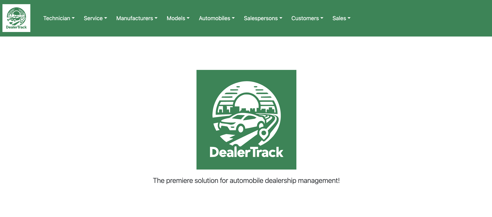
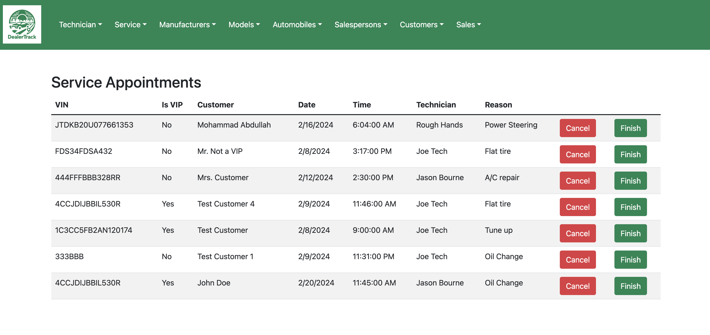
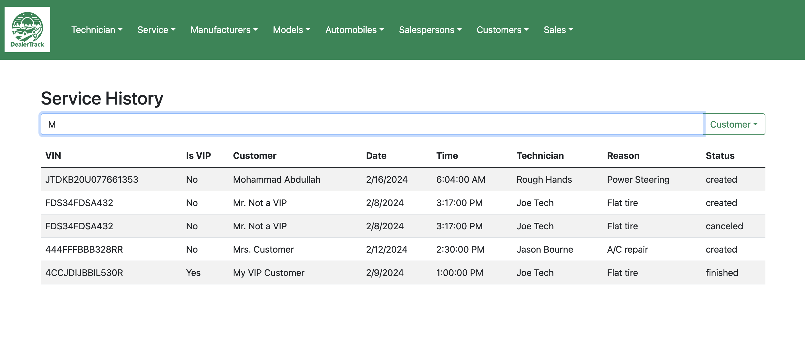
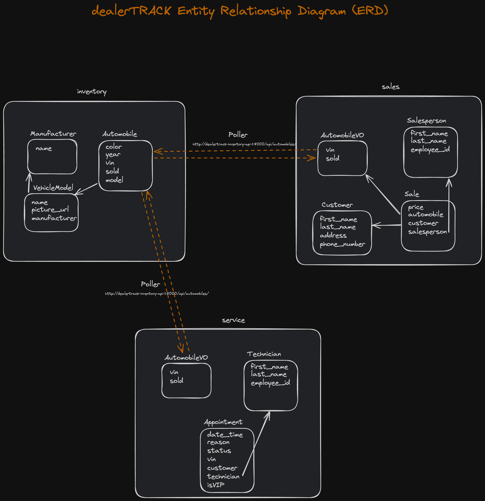

<h1 style="color:blue;text-align:center;">dealerTrack</h1>

Thanks for visiting 👋 This is my full-stack dealership management web application that is capable of managing service, sales, and inventory. It is responsive, dynamic, and includes persistent database storage. This was designed using Domain Driven Design and a microservice infrastructure that can be deployed in a Docker container using the technologies listed below.

<br/>

## Tech Stack

**Frontend:**

<span></span>
<span></span>
<span></span>
<span></span>
<span></span>


**Backend:**

<span></span>
<span></span>

**Database:**

<span></span>

**Deployment**


<br/>

## Website Images




<br/>
<br/>



<br/>
<br/>



<br/>
<br/>


## Database Model Diagram


<br/>


## How to Setup the project locally

Clone the project

```bash
  git clone https://github.com/jkluse/dealertrack.git
```

Go to the project directory

```bash
  cd dealertrack
```

Install dependencies

```bash
  cd ghi/app
  npm install
```

Create a Volume, Build and Run the Docker Images

```bash
  cd <root project directory>
  docker volume create beta-data
  docker-compose build
  docker-compose up
```

On Browser:
```
go to http://localhost:3000/
1. Create a manufacturer
2. Create a model
3. Create an automobile
4. Create a technician
5. Create a salesperson
6. Create a customer
...then you can create a service appointment, a sale
...On Salesperson history, you can filter by salesperso
...On Service Appointments, you can filter by VIN, customer, or technician
```

## Author

- [John Kluse (Github profile) ](https://www.github.com/jkluse)
